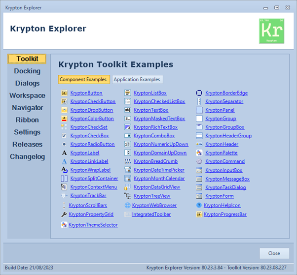

# Standard-Toolkit-Demos
There are 2 set of solutions in these projects:
- Dev
  - Direct linkage to the Toolkit projects and will build all TFM's in those
- Nuget
  - will use Nuget to pull in the `Canary.Lite` release to allow immediate usage of the example codebase.  

**If / when** you switch between them, **then** make sure you perform a clean build each time  

