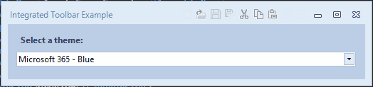
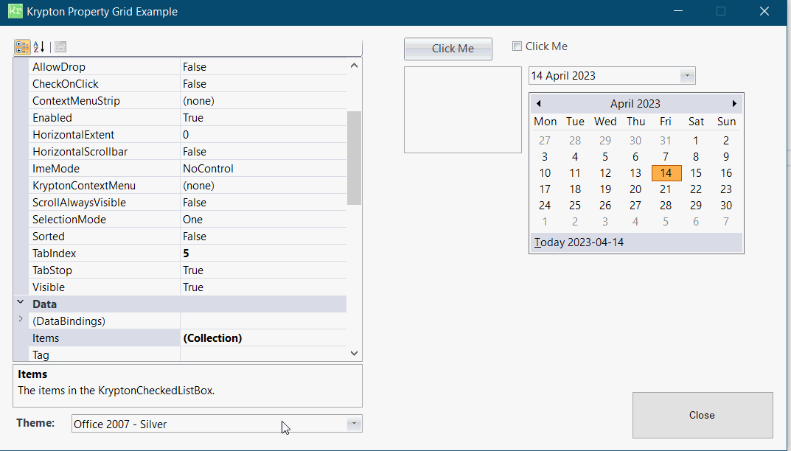
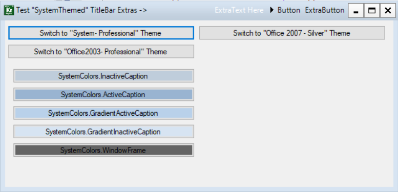

<!-- Start Document Outline -->

* [Toolkit Examples](#toolkit-examples)
	* [ButtonSpec Playground](#buttonspec-playground)
	* [Child Control Stack](#child-control-stack)
	* [Custom Control using Palettes](#custom-control-using-palettes)
	* [Custom Control using Renderers](#custom-control-using-renderers)
	* [Expanding HeaderGroups (DockStyle)](#expanding-headergroups-dockstyle)
	* [Expanding HeaderGroups (Splitters)](#expanding-headergroups-splitters)
	* [Expanding HeaderGroups (Stack)](#expanding-headergroups-stack)
	* [Input Form](#input-form)
	* [Integrated Toolbars](#integrated-toolbars)
	* [Krypton Scrollbars](#krypton-scrollbars)
	* [Krypton Theme Selector](#krypton-theme-selector)
	* [KryptonBorderEdge Examples](#kryptonborderedge-examples)
	* [[KryptonBreadCrumb Examples](#kryptonbreadcrumb-examples)
	* [KryptonButton Examples](#kryptonbutton-examples)
	* [Krypton UAC Button](#krypton-uac-button)
	* [KryptonAboutToolkit Example](#krypton-about-toolkit-example)
	* [KryptonCheckBox Examples](#kryptoncheckbox-examples)
	* [KryptonCheckButton Examples](#kryptoncheckbutton-examples)
	* [KryptonCheckedListBox Examples](#kryptoncheckedlistbox-examples)
	* [KryptonCheckSet Examples](#kryptoncheckset-examples)
	* [KryptonColorButton Examples](#kryptoncolorbutton-examples)
	* [KryptonColorDialog](#kryptoncolordialog)
	* [KryptonComboBox](#kryptoncombobox)
	* [KryptonCommand](#kryptoncommand)
	* [KryptonContextMenu](#kryptoncontextmenu)
	* [KryptonDataGridView](#kryptondatagridview)
	* [KryptonDateTimePicker](#kryptondatetimepicker)
	* [KryptonDomainUpDown](#kryptondomainupdown)
	* [KryptonDropButton](#kryptondropbutton)
	* [KryptonFolderBrowserDialog](#kryptonfolderbrowserdialog)
	* [KryptonFontDialog](#kryptonfontdialog)
	* [KryptonForm](#kryptonform)
	* [KryptonGroup](#kryptongroup)
	* [KryptonGroupBox](#kryptongroupbox)
	* [KryptonHeader](#kryptonheader)
	* [KryptonHeaderGroup](#kryptonheadergroup)
	* [Krypton Help Icon](#krypton-help-icon)
	* [KryptonInputBox](#kryptoninputbox)
	* [KryptonLabel](#kryptonlabel)
	* [KryptonLinkLabel](#kryptonlinklabel)
	* [KryptonListBox](#kryptonlistbox)
	* [KryptonListView](#kryptonlistview)
	* [KryptonMaskedTextBox](#kryptonmaskedtextbox)
	* [KryptonMessageBox](#kryptonmessagebox)
	* [KryptonMonthCalendar](#kryptonmonthcalendar)
	* [KryptonNumericUpDown](#kryptonnumericupdown)
	* [KryptonOpenFileDialog](#kryptonopenfiledialog)
	* [KryptonPalette](#kryptonpalette)
	* [KryptonPanel](#kryptonpanel)
	* [KryptonPrintDialog](#kryptonprintdialog)
	* [KryptonProgressBar](#kryptonprogressbar)
	* [KryptonPropertyGrid](#kryptonpropertygrid)
	* [KryptonRadioButton](#kryptonradiobutton)
	* [KryptonRichTextBox](#kryptonrichtextbox)
	* [KryptonSaveFileDialog](#kryptonsavefiledialog)
	* [KryptonScrollBar](#kryptonscrollbar)
	* [KryptonSeparator](#kryptonseparator)
	* [KryptonSplitContainer](#kryptonsplitcontainer)
	* [KryptonTableLayoutPanel](#kryptontablelayoutpanel)
	* [KryptonTaskDialog](#kryptontaskdialog)
	* [KryptonTextBox](#kryptontextbox)
	* [KryptonTrackBar](#kryptontrackbar)
	* [KryptonTreeView](#kryptontreeview)
	* [KryptonWebBrowser](#kryptonwebbrowser)
	* [KryptonWrapLabel](#kryptonwraplabel)
	* [MDI Application](#mdi-application)
	* [SystemThemedForms](#systemthemedforms)
	* [Test Clipping](#test-clipping)
	* [Test Combo Domain Numeric](#test-combo-domain-numeric)
	* [Test MessageBox Clipping](#test-messagebox-clipping)
	* [Test Text Clipping](#test-text-clipping)
	* [Three Pane Application (Basic)](#three-pane-application-basic)
	* [Three Pane Application (Extended)](#three-pane-application-extended)

<!-- End Document Outline -->

# Toolkit Examples
There are 2 set of solutions in these projects:
- Dev
  - Direct linkage to the Toolkit projects and will build all TFM's in those
- Nuget
  - will use Nuget to pull in the `Canary.Lite` release to allow immediate usage of the example codebase.

**If / when** you switch between them, **then** make sure you perform a clean build each time  

## ButtonSpec Playground

## Child Control Stack

## Custom Control using Palettes

## Custom Control using Renderers

## Expanding HeaderGroups (DockStyle)
/example.png)
## Expanding HeaderGroups (Splitters)
/example.png)
## Expanding HeaderGroups (Stack)
/example.png)
## Input Form

## Integrated Toolbars

## Krypton Scrollbars

## Krypton Theme Selector
- Automatically filled ComboBox with events to change the theme when selection changes:

## KryptonBorderEdge Examples

## [KryptonBreadCrumb Examples

## KryptonButton Examples

## Krypton UAC Button

## Krypton About Toolkit Example

## KryptonCheckBox Examples

## KryptonCheckButton Examples

## [KryptonCheckedListBox Examples

## KryptonCheckSet Examples

## KryptonColorButton Examples

## KryptonColorDialog

## KryptonComboBox

## KryptonCommand

## KryptonContextMenu

## KryptonDataGridView

## KryptonDateTimePicker

## KryptonDomainUpDown

## KryptonDropButton

## KryptonFolderBrowserDialog

## KryptonFontDialog

## KryptonForm

## KryptonGroup

## KryptonGroupBox

## KryptonHeader

## KryptonHeaderGroup

## Krypton Help Icon

## KryptonInputBox

## KryptonLabel

## KryptonLinkLabel

## KryptonListBox

## KryptonListView
- If you want a standard List then use `ListBox` or `CheckedListBox`
- If you want a Details view then use a `DataGrid`
- This implements LargIcons / Small Icons / Tiles with and without checkboxes as allowed

## KryptonMaskedTextBox

## [KryptonMessageBox

## KryptonMonthCalendar

## KryptonNumericUpDown

## KryptonOpenFileDialog

## KryptonPalette

## KryptonPanel

## KryptonPrintDialog

## KryptonProgressBar

## KryptonPropertyGrid

## KryptonRadioButton

## KryptonRichTextBox

## KryptonSaveFileDialog

## KryptonScrollBar

## KryptonSeparator

## KryptonSplitContainer

## KryptonTableLayoutPanel

## KryptonTaskDialog

## KryptonTextBox

## KryptonTrackBar

## KryptonTreeView

## KryptonWebBrowser

## KryptonWrapLabel

## MDI Application

## SystemThemedForms

## Test Clipping

## Test Combo Domain Numeric

## Test MessageBox Clipping

## Test Text Clipping

## Three Pane Application (Basic)
/example.png)
## Three Pane Application (Extended)
/example.png)

